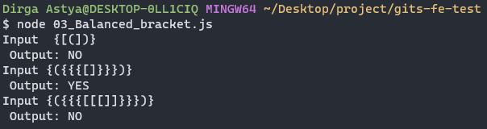

# Internship Problem Solving Test

```txt
Name : Dirga Astya Wisnuwardana
Role : Front End
```

### 1. A000124 of Sloane’s OEIS

Output :


### 2. Dense Ranking

Output :


### 3. Balanced Bracket

Output :


Penjelasan :

Telah dibuat sebuah function bernama `isBalancedBrackets` yang bertujuan untuk mengetahui apakah bracket pada sebuah input memiliki bracket yang seimbang.

Pada function ini dibuat sebuah object untuk memasangkan dari masing-masing jenis bracket

```javascript
const bracketPairs = {
    ")": "(",
    "}": "{",
    "]": "[",
};
```

Setelah itu dibuat sebuah array kosong dengan nama `bracket` untuk menyimpan bracket buka sehingga pada saat proses iterasi jika `input ke-i` merupakan bracket buka maka `input ke-i` akan dimasukan kedalam variabel tersebut.

Setelah itu, apabila `input ke-i` merupakan bracket tutup maka akan divalidasi kembali jika panjang array `bracket` bernilai 0 atau jika nilai terkahir dari array `bracket` tidak sama dengan pasangan yang telah di tentukan pada object `bracketPairs` maka akan return `NO`

Setelah proses iterasi dilakukan, dilakukan pengecekan kembali apabila array masih memeliki nilai maka return `NO`

Lalu, setelah semua rangkaian proses iterasi dan validasi selesai maka akan mengembalikan nilai string `YES`
